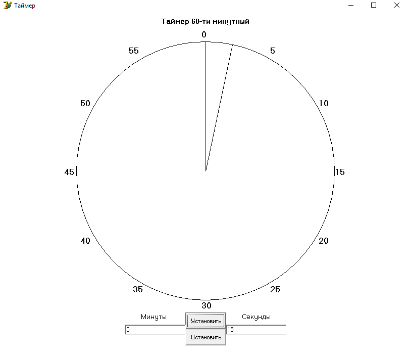

# Simple-Timer
(Delphi) Simple 60 minutes timer with alarm

# Basic overview
Simple 60 minutes timer program with alarm written in Deplphi.
You can set time intervals and alarms.
Need Delphi 7 or later.

